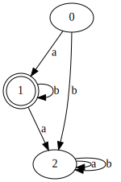

# Finite State Machine

- Create, evaluate and validate a finite state machine in C++. 
- You can generate a DOT file to see the states and links.

## Example

The "0" state is always the begin state.